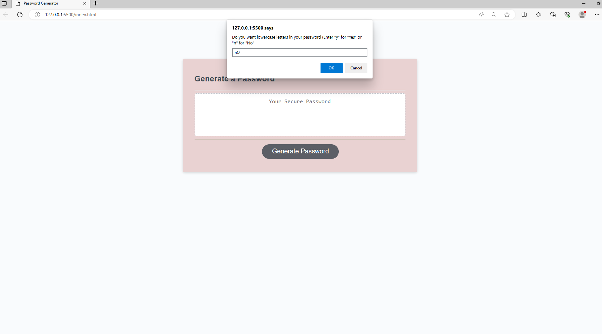

# 03 JavaScript: Password Generator

## Task Desciption

This application that enables employees to generate random passwords based on criteria that they’ve selected. 
The app will run in a browser which utilizes HTML, CSS and JavaScript.

The password can include UPPERCASE letter, lowercase letters, special characters, and numbers. Users have enter "yes" or "no" (not case sensitive) to select type of characters to include in the password.. If users select "no" in all cases, no password will be generated.

## User Story

```
AS AN employee with access to sensitive data
I WANT to randomly generate a password that meets certain criteria
SO THAT I can create a strong password that provides greater security
```

## Acceptance Criteria

```
GIVEN I need a new, secure password
WHEN I click the button to generate a password
THEN I am presented with a series of prompts for password criteria
WHEN prompted for password criteria
THEN I select which criteria to include in the password
WHEN prompted for the length of the password
THEN I choose a length of at least 8 characters and no more than 128 characters
WHEN asked for character types to include in the password
THEN I confirm whether or not to include lowercase, uppercase, numeric, and/or special characters
WHEN I answer each prompt
THEN my input should be validated and at least one character type should be selected
WHEN all prompts are answered
THEN a password is generated that matches the selected criteria
WHEN the password is generated
THEN the password is either displayed in an alert or written to the page
```

## Mock-Up

The following image shows the web application's appearance and functionality:


 
 
 
 
 


## URLs

You are required to submit the following for review:

* The URL of the deployed application.

* The URL of the GitHub repository, with a unique name and a readme describing the project.

- - -
© 2023 edX Boot Camps LLC. Confidential and Proprietary. All Rights Reserved.
